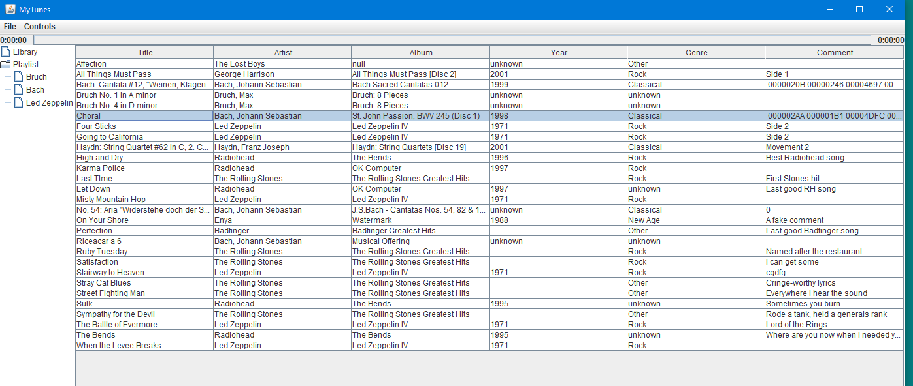
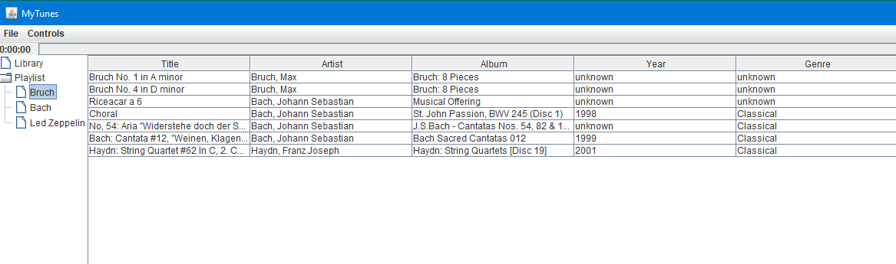
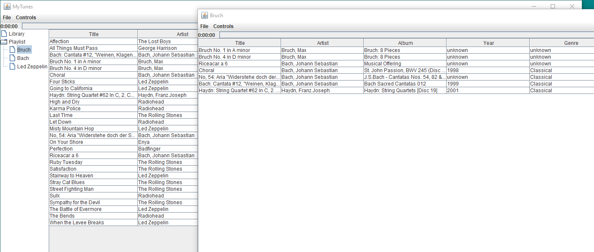
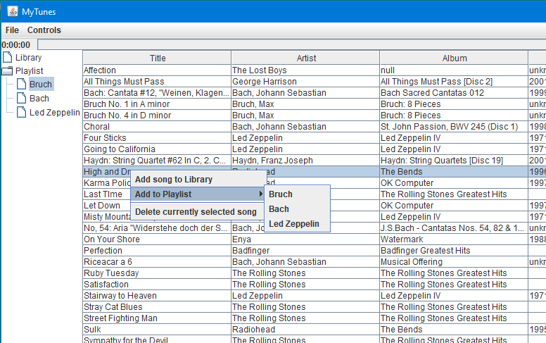
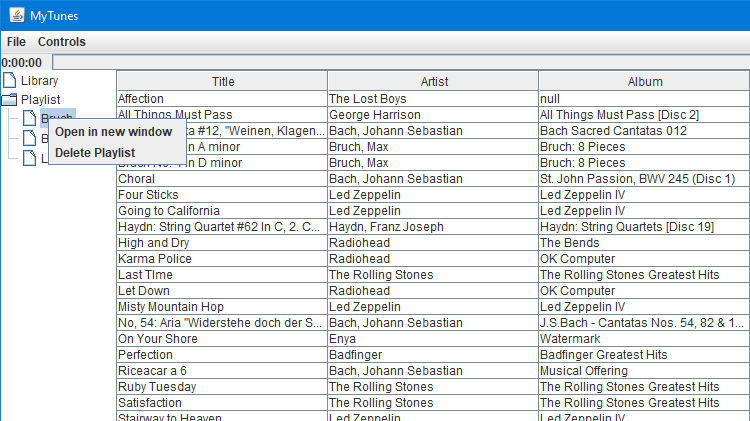
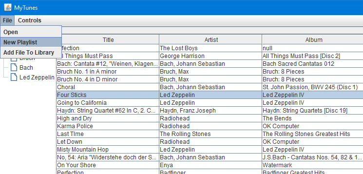
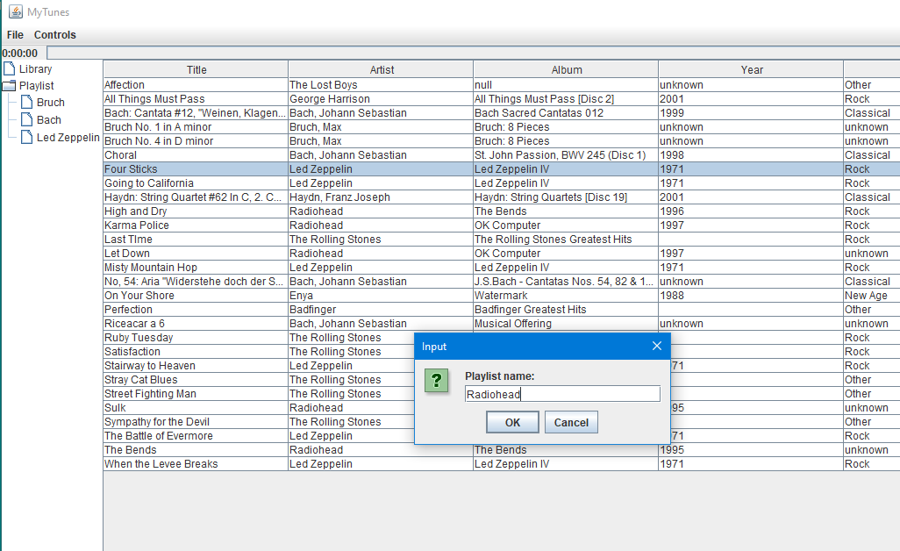
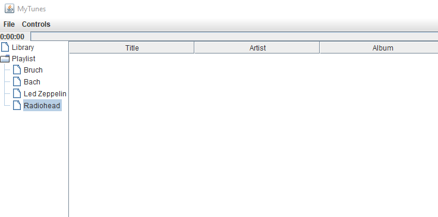
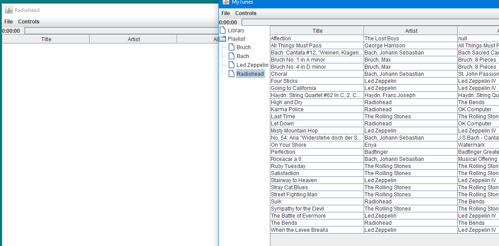
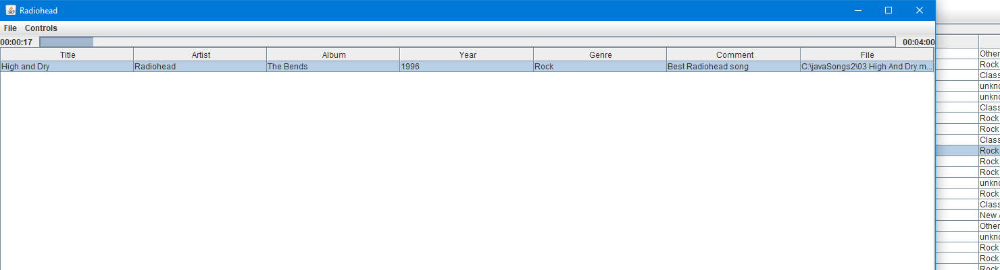

# Project-MP3-Player-
Design a fully functional MP3 player.

This repository contains all the files nessesary to run the MP3 player. An SQL database is needed in order to run this project. 

Pictures

Playlist panel with trees.

 
Playlist "Bruch" selected and displayed in the main frame.

Playlist "Bruch" moved to a separate window and main frame window filled with the song library. Multiple playlist may be open simultaneously.

Popup menu for adding a selected song to a playlist.

 
 
Open playlist in a new window popup menu - playlist must be selected.

Create a new playlist from menu "File".

 

Dialog to name the playlist.

MyTunes after playlist Radiohead is created. 

  

Radiohead playlist to separate window.

 
 
Radiohead playlist after "High and Dry" dragged from MyTunes library to playlist.

A song may appear in multiple playlists. It should only in the DB once. A very simple playlist song tactic is to create a table with playlist IDs and song IDs. Do not duplicate the song tag data.
